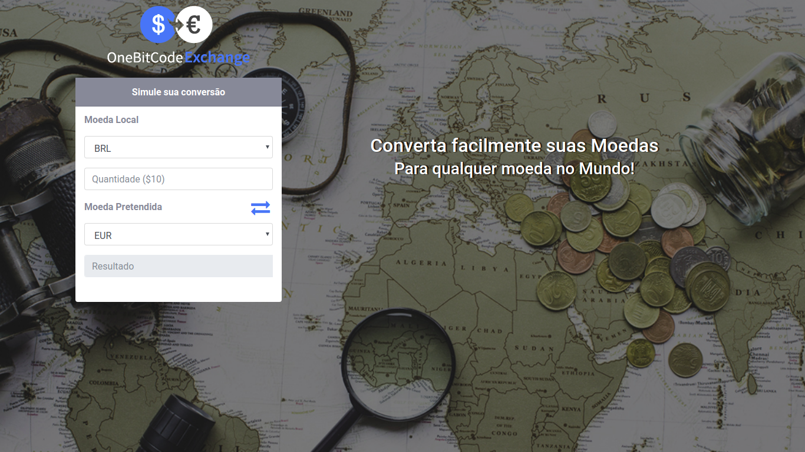

# About

Application lets you see conversion value from one currency to another.



## Purpose

This project has with purpose the learning new skills. The project was developed following the lessons of bootcamp in the [OneBitCode](onebitcode.com), with exception of some features that was developed for to conclude the challenges proposed. Follow the features developed for me (challenges):  

* Dynamic consult (without necessity of the button to convert)
* User possibility change the coins clicking in the button (alter the coins each other)

## Prerequisites

* Docker
* Docker Compose

## Getting started

The steps below will help you in the building this project in the development and test environment:

### 1. Clone the project
``` 
git clone git@github.com:rivelinojunior/bootcampSFS-currencyconversion.git
```

### 2. Building the project with docker/docker-compose
```
docker-compose build
docker-compose run --rm website bundle exec rails db:create db:migrate
docker-compose up
```

### 3. Access the application in your browser

> localhost:3000

## Running the test

```
docker-compose run --rm website bundle exec rspec
```

## Building with the technologies

* Ruby on Rails 5
* Docker / Docker-compose
* Rspec

## Credits
* Rivelino Junior - [@rivelinojunior](http://github.com/rivelinojunior)
* Onebitcode - [blog](http://www.onebitcode.com)
